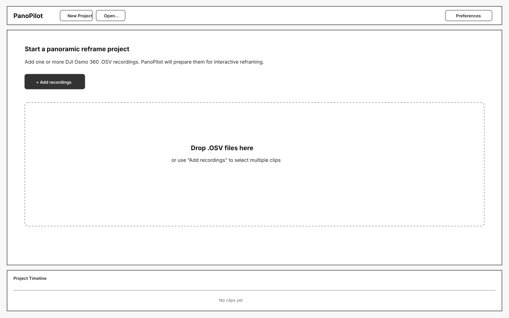
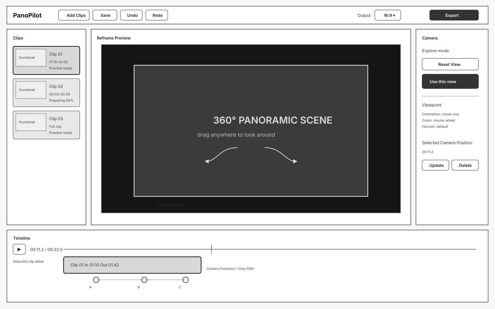
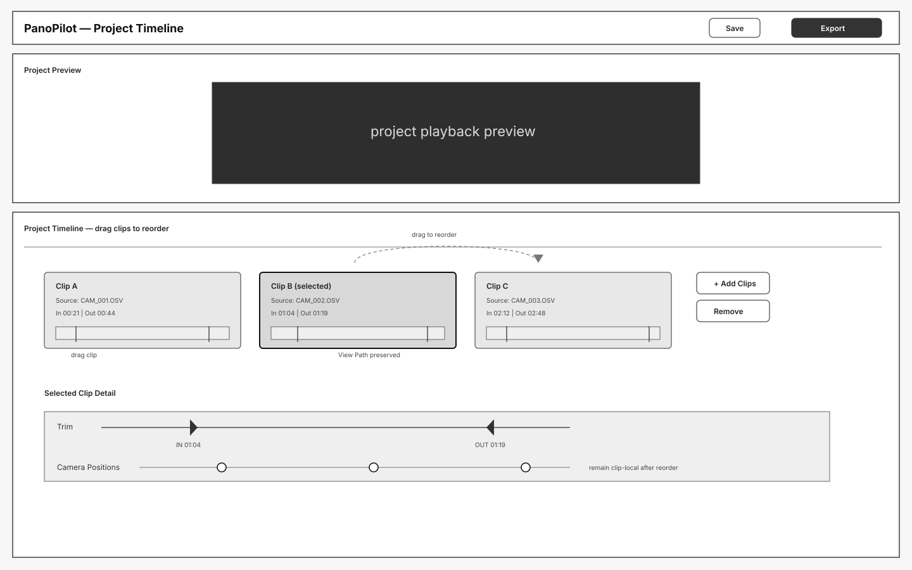
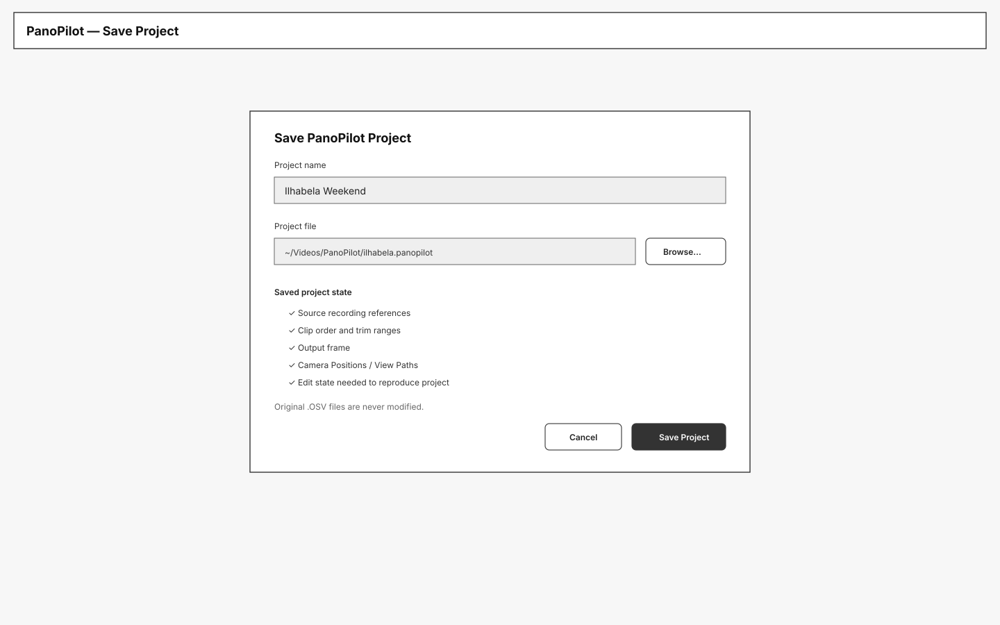
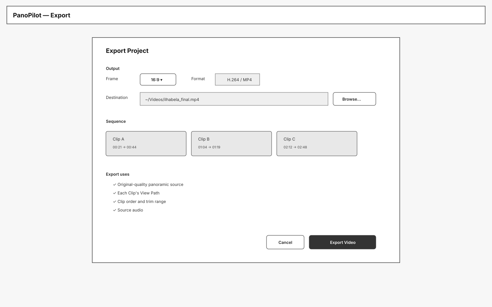
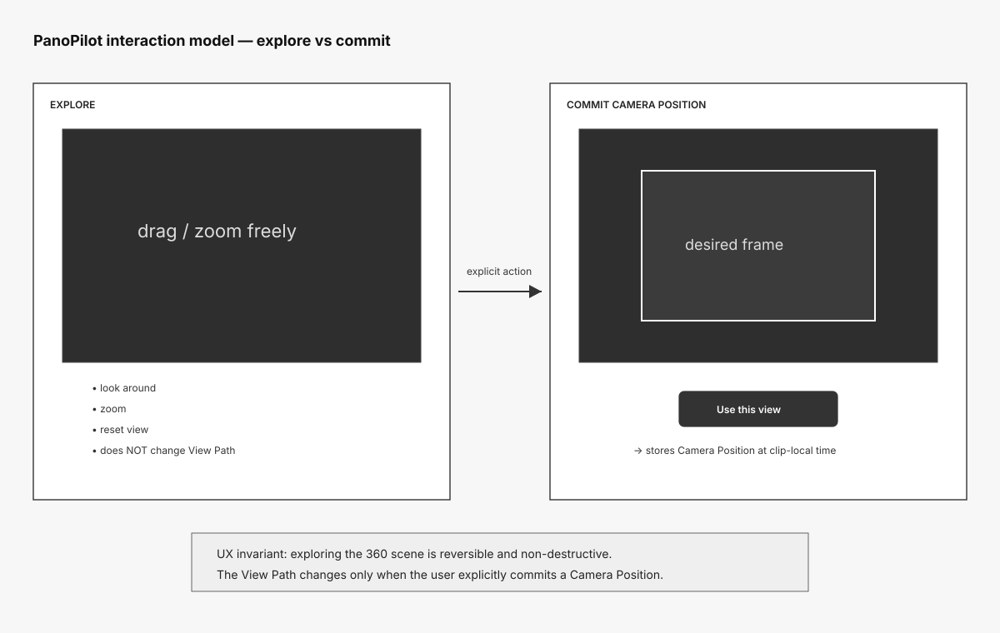

# PanoPilot — UX Wireframes

Status: Draft  
Scope: Iteration 1

These are low-fidelity static wireframes intended to validate the desktop interaction model before implementation.

## 1. New Project

Purpose: establish the empty-project experience and multi-file `.OSV` ingest.

## 2. Main Reframe Workspace

Purpose: validate the core PanoPilot workspace: clips, panoramic preview, direct mouse reframing, Camera Positions, View Path, and the clip-local timeline.

## 3. Multi-Clip Timeline

Purpose: validate multi-clip sequencing, direct reordering, non-destructive trim ranges, and preservation of each Clip's View Path.

## 4. Save Project

Purpose: make project persistence explicit while reinforcing that `.OSV` source recordings remain immutable.

## 5. Export Project

Purpose: validate a deliberately simple Iteration-1 export flow: output frame, H.264/MP4 destination, project sequence, View Paths, trims, and source audio.

## 6. Explore vs Commit

Purpose: capture the most important interaction invariant: looking around the panoramic scene does **not** modify the edit until the user explicitly chooses **Use this view**.

## UX decisions represented in these wireframes

- PanoPilot is a **desktop panoramic reframing application**, not a general-purpose NLE.
- Multiple `.OSV` recordings can be added at once.
- Clips are sequential and can be reordered directly.
- Each Clip owns its own trim range and View Path.
- The center of the product is the **reframed output view**, not the raw equirectangular image.
- Mouse drag changes the virtual-camera view; mouse wheel changes zoom.
- Exploration is distinct from committed Camera Positions.
- Camera Positions remain clip-local, so clip reordering does not invalidate reframing.
- 16:9 and 9:16 are project-level output-frame choices.
- Preview and export preserve source audio.
- Project save/load is part of the first usable iteration.
